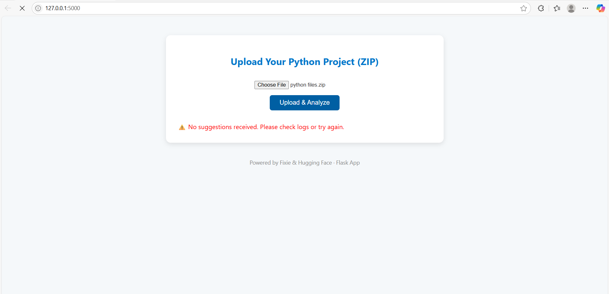
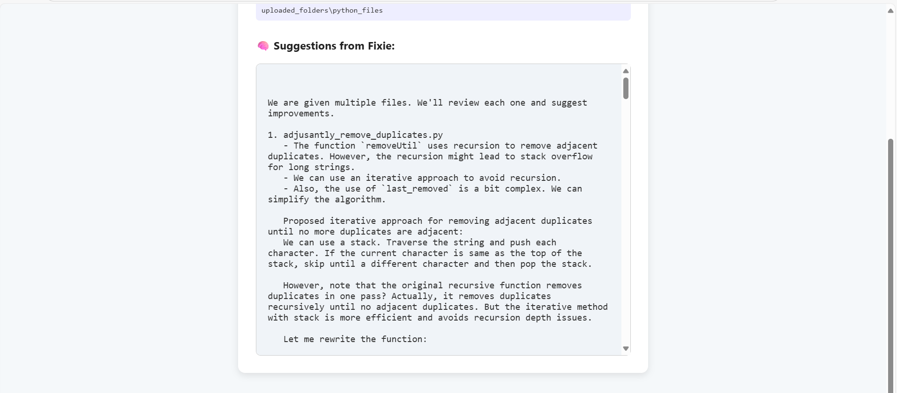

# 🧠 Fixie – The Project Reviewer

Fixie is an AI-powered web app that reviews zipped Python projects and provides smart code improvement suggestions. Simply upload a `.zip` file of your Python code, and Fixie will analyze the contents and return feedback using a Hugging Face-powered language model.

---

## 📸 Screenshots

| Upload Interface | Review Output |
|------------------|----------------|
|  |  |


---

## 🚀 Features

- ✅ Upload zipped Python projects
- 🧠 Automatic code extraction and analysis
- 💬 AI-generated suggestions for code improvement
- 🌐 Simple, responsive UI with Flask + HTML/CSS

---

## 🛠️ Technologies Used

- **Python 3**
- **Flask** – Web framework
- **HTML/CSS** – Frontend styling
- **Hugging Face API** – AI model (e.g., Kimi, LLaMA)
- **zipfile** – For .zip handling
- **os / shutil** – File management
- **PyMuPDF (Optional)** – For resume/PDF parsing

---

## 🧩 Folder Structure
Fixie-Project-Reviewer/
│
├── app.py # Main Flask app
├── huggingface_api.py # Handles LLaMA API calls
├── services.py # Python file parser
├── templates/
│ └── upload.html # UI Template
├── uploaded_folders/ # Temp uploads
├── screenshots/ # App screenshots for README
├── README.md # This file
└── .gitignore


---

## ⚙️ Setup Instructions

1. **Clone the repo**
   ```bash
   git clone https://github.com/KhushbooChaudhari/fixie-The-project-reviewer.git
   cd fixie-The-project-reviewer
   
2. **Create Virtual Environment**
   python -m venv venv
venv\Scripts\activate  # Windows

3. **Run Project**
   python app.py


